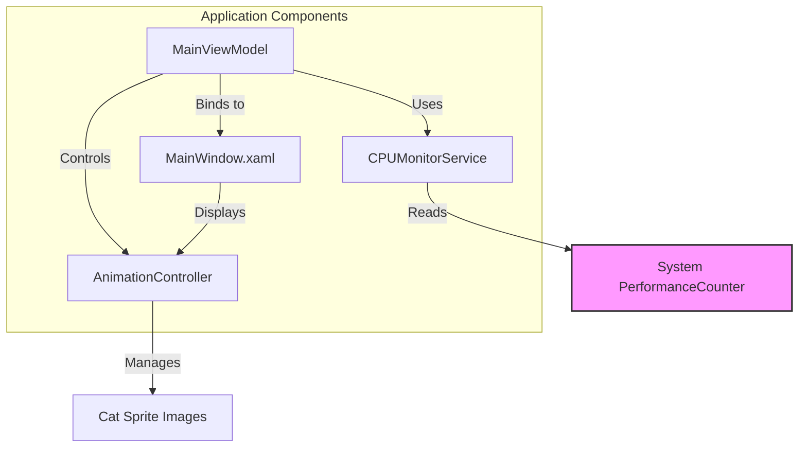

# System Patterns: Taskbar Cat CPU Monitor

## 1. Architectural Overview

The application follows a simple, service-oriented architecture combined with the Model-View-ViewModel (MVVM) pattern, which is standard for WPF applications.

## 2. Key Components & Patterns

### a. Model-View-ViewModel (MVVM)

- **View (`MainWindow.xaml` & `MainWindow.xaml.cs`)**: The UI of the application. It is responsible for displaying the cat animation. It will be a borderless, transparent window containing an `Image` control. Its code-behind will be minimal, primarily handling window-specific logic like positioning.
- **ViewModel (`MainViewModel.cs`)**: The brain of the UI. It will expose properties that the View binds to, such as the current animation frame (`BitmapImage`). It will orchestrate the interaction between the `CPUMonitorService` and the `AnimationController`.
- **Model**: In this simple application, our models are the raw data: the CPU percentage and the image files for the animation.

### b. Service Layer

- **`CPUMonitorService.cs`**: A singleton or static service responsible for encapsulating the logic of querying the `PerformanceCounter`. This decouples the core business logic (getting CPU data) from the UI, making it reusable and easier to test.

### c. Controller Pattern

- **`AnimationController.cs`**: This class will manage the state of the animation. It will:
    1.  Load all animation frames (e.g., `cat-run-1.png`, `cat-run-2.png`, etc.) into memory.
    2.  Maintain a pointer to the current frame.
    3.  Provide a method to advance to the next frame.
    4.  Adjust the speed of the animation based on the CPU percentage passed from the ViewModel.

## 3. Data Flow

1.  A `DispatcherTimer` in the `MainViewModel` ticks periodically (e.g., every 100ms).
2.  On each tick, the ViewModel calls the `CPUMonitorService` to get the latest CPU usage percentage.
3.  The ViewModel passes this percentage to the `AnimationController`.
4.  The `AnimationController` determines if it's time to switch to the next animation frame based on the CPU-adjusted speed.
5.  If a frame change is needed, the `AnimationController` updates its current frame.
6.  The `MainViewModel` exposes the `AnimationController`'s current frame as a property.
7.  The `Image` control in the `MainWindow` is data-bound to this property and automatically updates, creating the animation.
